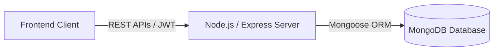

<div align="center">
  
# TradeXpert 🚀
  
**A Modern, Full-Stack Stock Trading Platform**

[](https://reactjs.org/)
[](https://nodejs.org/)
[](https://expressjs.com/)
[](https://www.mongodb.com/)
[](https://tailwindcss.com/)

[Explore the App](#) · [Report Bug](#) · [Request Feature](#)

</div>

---

## 🌟 Introduction

**TradeXpert** is a premium, production-grade full-stack stock trading web application inspired by the robust architecture and clean UI of modern trading platforms like Zerodha. 

Designed for both performance and user experience, TradeXpert provides a simulated real-world online stock trading environment. Users can seamlessly register, securely log in, and manage their investments through a highly interactive, personalized dashboard. Built with the powerful MERN stack, the platform emphasizes security, speed, and real-time portfolio tracking.

Whether you're looking to explore modern web architectures or testing your trading strategies, TradeXpert delivers a seamless, institutional-grade experience.

---

## ✨ Key Features

### 📈 Trading Features
- **Buy & Sell Stocks:** Intuitive interface for executing market orders.
- **Portfolio Management:** Real-time tracking of your asset allocation.
- **Transaction History:** Detailed ledger of all past trades and fund movements.
- **Holdings Dashboard:** Comprehensive view of current stock holdings and their performance.

### 🔐 Authentication & Security
- **JWT Authentication:** Robust token-based authorization for API endpoints.
- **Secure Onboarding:** Real email and password registration with encrypted storage.
- **Password Hashing:** Industry-standard `bcrypt` hashing for user credentials.
- **Protected Routes:** Frontend and backend route guards to prevent unauthorized access.
- **Role-Based Access:** Extensible architecture supporting multiple user privileges.

### 📊 Dashboard Analytics
- **Portfolio Summary:** High-level overview of total investments, current value, and overall returns.
- **Profit/Loss Overview:** Dynamic visualization of daily and all-time P&L.
- **User Statistics:** Actionable insights into trading habits and performance.
- **Holdings Analytics:** Deep dive into individual asset performance metrics.

### 👤 User Profile System
- **Profile Management:** Update personal details and preferences seamlessly.
- **Account Summary:** Quick access to available funds and account health.
- **Activity Tracking:** Monitor recent logins and account changes for enhanced security.

---

## 🏗️ Architecture

TradeXpert utilizes a decoupled, microservices-inspired monolithic architecture, ensuring high cohesion and low coupling across the stack.



- **Frontend (Client):** A blazing-fast single-page application (SPA) built with React.js, featuring state management and responsive design for an app-like feel.
- **Backend (Server):** A scalable Node.js runtime powered by Express.js, handling complex business logic, user authentication, and data validation.
- **Database:** MongoDB, a flexible NoSQL database, optimized for handling dynamic financial data models like holdings, positions, and user profiles.

---

## 🛠️ Tech Stack

### Frontend
- **React.js** - UI Library for building interactive user interfaces
- **Tailwind CSS / Bootstrap** - Utility-first styling for premium aesthetics
- **Axios** - Promise-based HTTP client for seamless API communication
- **React Router DOM** - Declarative routing for React web applications

### Backend
- **Node.js** - Asynchronous event-driven JavaScript runtime
- **Express.js** - Fast, unopinionated, minimalist web framework
- **JSON Web Tokens (JWT)** - Secure transmission of information as a JSON object
- **bcrypt** - Password-hashing function for enhanced data security

### Database
- **MongoDB** - Document-based NoSQL database for flexible and scalable storage
- **Mongoose** - Elegant MongoDB object modeling for Node.js

---

## 📂 Project Structure

```text
TradeXpert-new/
├── backend/                  # Express.js server & REST APIs
│   ├── index.js              # Entry point
│   ├── controllers/          # Business logic for routes
│   ├── middlewares/          # Custom middlewares (e.g., authMiddleware)
│   ├── model/                # Mongoose database models
│   ├── schemas/              # Data validation schemas
│   └── routes/               # API endpoint definitions
├── dashboard/                # React.js frontend application
│   ├── src/
│   │   ├── components/       # Reusable UI components
│   │   ├── pages/            # View components (Dashboard, Login, etc.)
│   │   ├── context/          # Global state management
│   │   └── App.js            # Main application component
│   └── public/               # Static assets
└── README.md                 # Project documentation
```

---

## 🚀 Quick Start

Follow these instructions to get a local copy up and running.

### Prerequisites
- [Node.js](https://nodejs.org/en/download/) (v14 or higher)
- [MongoDB](https://www.mongodb.com/try/download/community) (Local or Atlas URI)
- Git

### Installation

1. **Clone the repository**
   ```bash
   git clone https://github.com/your-username/TradeXpert-new.git
   cd TradeXpert-new
   ```

2. **Backend Setup**
   ```bash
   cd backend
   npm install
   ```
   Create a `.env` file in the `backend` directory and add your environment variables:
   ```env
   PORT=3002
   MONGO_URL=your_mongodb_connection_string
   JWT_SECRET=your_super_secret_key
   ```
   Start the backend server:
   ```bash
   npm start
   # or for development: npm run dev
   ```

3. **Frontend Setup**
   Open a new terminal window/tab:
   ```bash
   cd dashboard
   npm install
   ```
   Create a `.env` file in the `dashboard` directory (if needed):
   ```env
   REACT_APP_API_URL=http://localhost:3002
   ```
   Start the frontend development server:
   ```bash
   npm start
   ```

4. **Explore the App**
   Open [http://localhost:3000](http://localhost:3000) to view it in the browser.

---

## 🛡️ Security

Security is treated as a first-class citizen in TradeXpert:
- **JWT Authentication:** Stateless, secure sessions managed via HttpOnly cookies or Authorization headers.
- **Password Hashing:** Passwords are never stored in plaintext. `bcrypt` with appropriate salt rounds ensures credential safety.
- **Protected APIs:** Critical endpoints (buying/selling, viewing portfolio) require valid authorization tokens.
- **Secure Sessions:** Implementation of modern security headers and CORS policies to prevent cross-site request forgery and other common web vulnerabilities.

---

## 🗺️ Future Roadmap

We are continuously working to evolve TradeXpert into a world-class trading platform. Upcoming features include:

- [ ] **Real-time Stock APIs:** Integration with live market data feeds (e.g., Alpha Vantage, Finnhub).
- [ ] **Live Interactive Charts:** Implementation of TradingView or similar advanced charting libraries.
- [ ] **AI Trading Insights:** Predictive analytics and market sentiment analysis.
- [ ] **Dynamic Watchlists:** Customizable tracking of favorite stocks with alert systems.
- [ ] **Mobile Application:** A React Native companion app for trading on the go.
- [ ] **Portfolio Prediction:** Machine learning models to forecast potential portfolio growth.

---

## 📄 License

Distributed under the MIT License. See `LICENSE` for more information.

---

<div align="center">
  <b>Built with ❤️ by an aspiring Full-Stack Engineer.</b><br>
  If you like this project, please consider giving it a ⭐!
</div>
